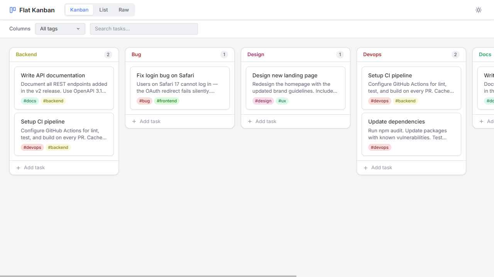

# Plain Kanban — Flat Kanban

A single web page, local-first Kanban app powered by plain text file that runs entirely in the browser.

Try it out at https://ramiresviana.github.io/flat-kanban

## Features

- 🏠 Local-first: Your data stays in your browser.
- 🚀 Zero-install: Just open index.html and start working.
- 🖐️ Drag & drop: Organize your workflow visually.
- 🔍 Smart Tags: Quick autocomplete for organized categorization.
- 👯 Live Sync: Multiple tabs, one single source of truth.
- 📂 Data Freedom: Export or import your plain-text database anytime.